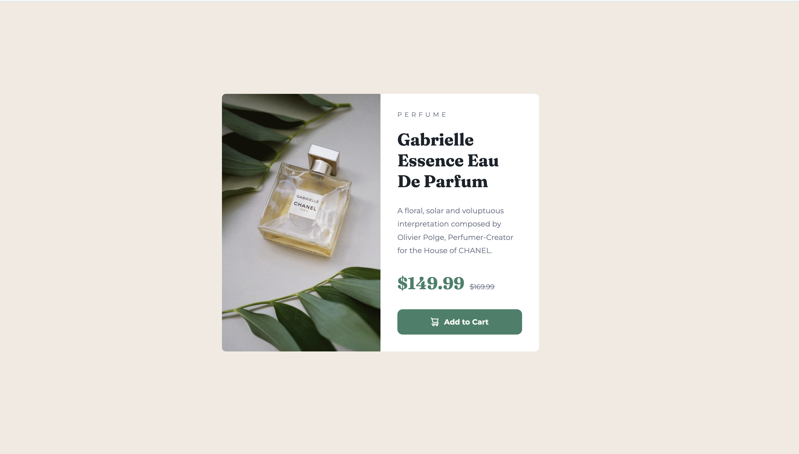

# Frontend Mentor - Product preview card component solution

This is a solution to the [Product preview card component challenge on Frontend Mentor](https://www.frontendmentor.io/challenges/product-preview-card-component-GO7UmttRfa). Frontend Mentor challenges help you improve your coding skills by building realistic projects. 

## Overview
My solution to the product-preview card component using flexbox. 
https://domleverment.github.io/product-preview-card-component/

### The challenge

Users should be able to:

- View the optimal layout depending on their device's screen size
- See hover and focus states for interactive elements

### Screenshot

### Built with

- Semantic HTML5 markup
- CSS custom properties
- Flexbox
- Chat GPT

### Continued development

Continue to practice 
- Media Queries
- CSS Grid for new solutions

## Author

- Frontend Mentor - [@DomLeverment](https://www.frontendmentor.io/profile/DomLeverment)

